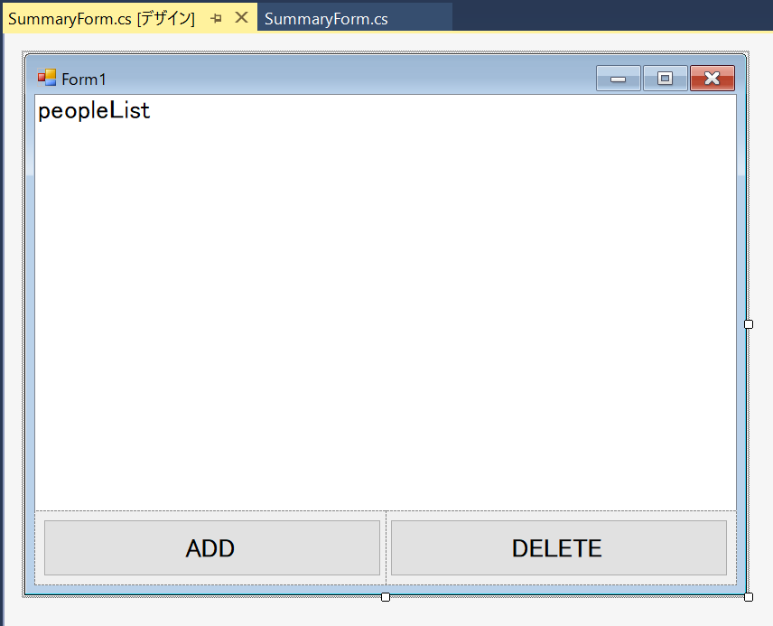
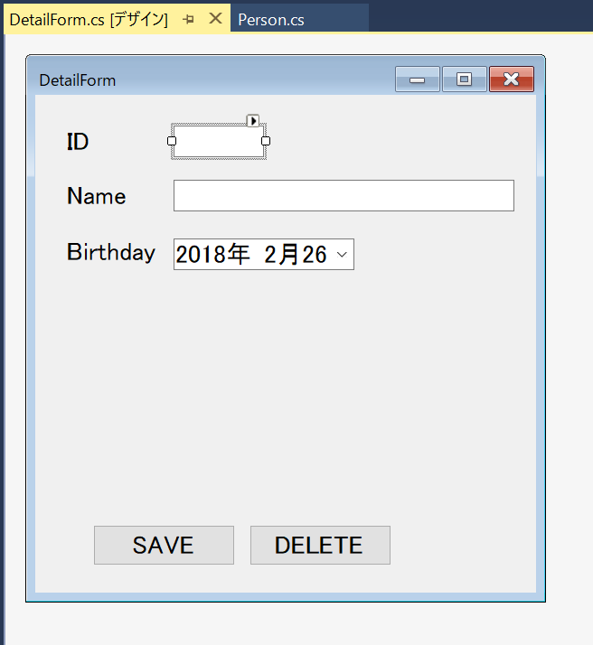

# 張り付け用のスニペットです。

## Windows Forms

Windows Forms プロジェクト用

### Models/Person.cs

```csharp
// Personクラス内

[JsonProperty(PropertyName = "id")]
public int Id { get; set; }
[JsonProperty(PropertyName = "name")]
public string Name { get; set; }
[JsonProperty(PropertyName = "birthday")]
public DateTimeOffset Birthday { get; set; }

/// <summary>
/// ListBoxに表示される文字列
/// </summary>
/// <returns></returns>
public override string ToString()
{
    return $"{Id}:{Name} {Birthday.Year}/{Birthday.Month}/{Birthday.Day}";
}
```

### Models/WebClient.cs

```csharp
class AuthResult
{
    [JsonProperty(PropertyName = "access_token")]
    public string AccessToken { get; set; }
}
```


```csharp
public static WebApiClient Instance { get; set; } = new WebApiClient();

private Uri baseAddress = ApiKeys.BaseAddress;
private string Token = "";
private object locker = new object();

private readonly string _name = "admin";
private readonly string _password = "p@ssw0rd";

private WebApiClient()
{
}
```


```csharp
private void Initialize(string name, string password)
{
    lock (locker)
    {
        if (string.IsNullOrEmpty(Token))
        {
            try
            {
                using (var client = new HttpClient())
                {
                    client.BaseAddress = baseAddress;

                    var authContent = new StringContent($"grant_type=password&username={name}&password={password}");
                    authContent.Headers.ContentType = new MediaTypeHeaderValue("application/x-www-form-urlencoded");
                    var authResponse = client.PostAsync("/Token", authContent).Result;
                    authResponse.EnsureSuccessStatusCode();
                    var authResult = authResponse.Content.ReadAsStringAsync().Result;

                    Token = JsonConvert.DeserializeObject<AuthResult>(authResult).AccessToken;
                }
            }
            catch (Exception ex)
            {
                System.Diagnostics.Debug.WriteLine($"【InitializeError】{ex.Source},{ex.Message},{ex.InnerException}");
            }
        }
    }
}
```


```csharp
public async Task<ObservableCollection<Person>> GetPeopleAsync()
{
    Initialize(_name, _password);

    using (var client = new HttpClient())
    {
        client.BaseAddress = baseAddress;
        client.DefaultRequestHeaders.Authorization = new AuthenticationHeaderValue("Bearer", Token);

        try
        {
            var response = await client.GetAsync("api/People");
            response.EnsureSuccessStatusCode();

            var json = await response.Content.ReadAsStringAsync();
            return JsonConvert.DeserializeObject<ObservableCollection<Person>>(json);
        }
        catch (Exception ex)
        {
            System.Diagnostics.Debug.WriteLine($"【GetError】{ex.Source},{ex.Message},{ex.InnerException}");

            return null;
        }
    }
}
```


```csharp
public async Task<int> PostPersonAsync(Person person)
{
    Initialize(_name, _password);

    using (var client = new HttpClient())
    {
        client.BaseAddress = baseAddress;
        client.DefaultRequestHeaders.Authorization = new AuthenticationHeaderValue("Bearer", Token);

        try
        {
            var content = new StringContent(JsonConvert.SerializeObject(person));
            content.Headers.ContentType = new MediaTypeHeaderValue("application/json");
            var response = await client.PostAsync("api/People", content);
            response.EnsureSuccessStatusCode();

            var result = await response.Content.ReadAsStringAsync();
            var id = JsonConvert.DeserializeObject<Person>(result).Id;

            return id;
        }
        catch (Exception ex)
        {
            System.Diagnostics.Debug.WriteLine($"【PostError】{ex.Source},{ex.Message},{ex.InnerException}");
            throw;
        }
    }
}
```


```csharp
public async Task<bool> UpdatePersonAsync(Person person)
{
    Initialize(_name, _password);

    using (var client = new HttpClient())
    {
        client.BaseAddress = baseAddress;
        client.DefaultRequestHeaders.Authorization = new AuthenticationHeaderValue("Bearer", Token);

        try
        {
            var content = new StringContent(JsonConvert.SerializeObject(person));
            content.Headers.ContentType = new MediaTypeHeaderValue("application/json");
            var response = await client.PutAsync($"api/People/{person.Id}", content);
            response.EnsureSuccessStatusCode();

            return true;
        }
        catch (Exception ex)
        {
            System.Diagnostics.Debug.WriteLine($"【UpdateError】{ex.Source},{ex.Message},{ex.InnerException}");

            return false;
        }
    }
}
```


```csharp
public async Task<bool> DeletePersonAsync(Person person)
{
    Initialize(_name, _password);

    using (var client = new HttpClient())
    {
        client.BaseAddress = baseAddress;
        client.DefaultRequestHeaders.Authorization = new AuthenticationHeaderValue("Bearer", Token);

        try
        {
            var response = await client.DeleteAsync($"api/People/{person.Id}");
            response.EnsureSuccessStatusCode();

            return true;
        }
        catch (Exception ex)
        {
            System.Diagnostics.Debug.WriteLine($"【DeleteError】{ex.Source},{ex.Message},{ex.InnerException}");

            return false;
        }
    }
}
```


### Views/SummaryForm



- ListBox(peopleList)
    - Name: peopleList
    - Dock: Fill
- TableLayoutPanel
    - Dock: Bottom
    - ColumnCount: 2
- Button(btnAdd／btnDelete)
    - Dock: Fill

#### Load Event

```csharp
/// <summary>
/// フォームが初期化されるときに呼ばれるので
/// ここで一覧を表示する
/// </summary>
/// <param name="sender"></param>
/// <param name="e"></param>
private async void SummaryForm_Load(object sender, EventArgs e)
{
    await UpdatePersonList();
}
```


```csharp
/// <summary>
/// リストの内容を表示する
/// </summary>
async Task UpdatePersonList()
{
    var webPeople = await WebApiClient.Instance.GetPeopleAsync();

    peopleList.Items.Clear();
    foreach (var person in webPeople)
    {
        peopleList.Items.Add(person);
    }
}
```


#### ListBox (SelectedIndexChanged)

```csharp
/// <summary>
/// リストを選択したら編集画面を表示する
/// </summary>
/// <param name="sender"></param>
/// <param name="e"></param>
private async void peopleList_SelectedIndexChanged(object sender, EventArgs e)
{
    if (peopleList.SelectedItem != null)
    {
        var selectPerson = (Person)peopleList.SelectedItem;
        if (new DetailForm(selectPerson).ShowDialog() == DialogResult.OK)
        {
            await UpdatePersonList();
        }
    }
}
```


#### Button(Click イベント)

```csharp
/// <summary>
/// 新規追加ボタン
/// </summary>
/// <param name="sender"></param>
/// <param name="e"></param>
private async void btnAdd_Click(object sender, EventArgs e)
{
    if (new DetailForm(null).ShowDialog() == DialogResult.OK)
    {
        await UpdatePersonList();
    }
}
```


```csharp
/// <summary>
/// データをすべて削除する
/// </summary>
/// <param name="sender"></param>
/// <param name="e"></param>
private async void btnDelete_Click(object sender, EventArgs e)
{
    if (MessageBox.Show("データをすべて削除します\nよろしいですか？", "確認", MessageBoxButtons.OKCancel) == DialogResult.OK)
    {
        var people = await WebApiClient.Instance.GetPeopleAsync();
        foreach (var person in people)
        {
            await WebApiClient.Instance.DeletePersonAsync(person);
        }

        await UpdatePersonList();
    }
}
```


### Views/DetailForm



- Label
- TextBox (edtId／edtName／dateTimeBirthday)
- Button (btnSave／btnDelete)


#### コンストラクター

```csharp
private Person Current { get; set; }

public DetailForm(Person person)
{
    InitializeComponent();
    Current = person;
}
```


#### Load イベント

```csharp
/// <summary>
/// フォームの初期化時に値をセットする
/// </summary>
/// <param name="sender"></param>
/// <param name="e"></param>
private void DetailForm_Load(object sender, EventArgs e)
{
    edtId.Enabled = false;
    if (Current != null)
    {
        edtId.Text = Current.Id.ToString();
        edtName.Text = Current.Name;
        dateTimeBirthday.Value = Current.Birthday.DateTime;
    }
    else
    {
        edtId.Text = "0";
        btnDelete.Enabled = false;
    }
}
```


#### Button (Click イベント)

```csharp
/// <summary>
/// フォームの初期化時に値をセットする
/// </summary>
/// <param name="sender"></param>
/// <param name="e"></param>
private void DetailForm_Load(object sender, EventArgs e)
{
    edtId.Enabled = false;
    if (Current != null)
    {
        edtId.Text = Current.Id.ToString();
        edtName.Text = Current.Name;
        dateTimeBirthday.Value = Current.Birthday.DateTime;
    }
    else
    {
        edtId.Text = "0";
        btnDelete.Enabled = false;
    }
}
```


```csharp
/// <summary>
/// 削除する
/// </summary>
/// <param name="sender"></param>
/// <param name="e"></param>
private async void btnDelete_Click(object sender, EventArgs e)
{
    await WebApiClient.Instance.DeletePersonAsync(Current);
    DialogResult = DialogResult.OK;
}
```


## WPF

WPF 用

### Views/SummaryWindow.xaml

```xml
<Window x:Class="LegacyToXamarin.WPF.Views.SummaryWindow"
        xmlns="http://schemas.microsoft.com/winfx/2006/xaml/presentation"
        xmlns:x="http://schemas.microsoft.com/winfx/2006/xaml"
        xmlns:d="http://schemas.microsoft.com/expression/blend/2008"
        xmlns:local="clr-namespace:LegacyToXamarin.WPF"
        xmlns:mc="http://schemas.openxmlformats.org/markup-compatibility/2006"
        Title="SummaryPage"
        Width="800"
        Height="600"
        Loaded="MainWindow_OnLoaded"
        mc:Ignorable="d">
    <Grid Margin="5">
        <Grid.RowDefinitions>
            <RowDefinition Height="*" />
            <RowDefinition Height="Auto" />
        </Grid.RowDefinitions>
        <Grid.ColumnDefinitions>
            <ColumnDefinition Width="50*" />
            <ColumnDefinition Width="50*" />
        </Grid.ColumnDefinitions>
        <ListBox Grid.ColumnSpan="2"
                 Grid.Row="0"
                 ItemsSource="{Binding}"
                 SelectionChanged="Selector_OnSelectionChanged">
            <ListBox.ItemTemplate>
                <DataTemplate>
                    <StackPanel Orientation="Horizontal">
                        <Label VerticalAlignment="Center" Content="{Binding Id}" />
                        <StackPanel>
                            <Label VerticalContentAlignment="Center" Content="{Binding Name}" />
                            <Label VerticalContentAlignment="Bottom"
                                   Content="{Binding Birthday}"
                                   ContentStringFormat="{}{0:yyyy年MM月dd日}" />
                        </StackPanel>
                    </StackPanel>
                </DataTemplate>
            </ListBox.ItemTemplate>
        </ListBox>
        <Button Grid.Row="1"
                Margin="10"
                Padding="10"
                Click="BtnAddClick"
                Content="Add" />
        <Button Grid.Column="1"
                Grid.Row="1"
                Margin="10"
                Padding="10"
                Click="BtnAllDataClick"
                Content="Clear all data" />

    </Grid>
</Window>
```


### Views/SummaryWindow.xaml.cs


```csharp
public ObservableCollection<Person> PeopleList { get; set; } = new ObservableCollection<Person>();
```


```csharp
public SummaryWindow()
{
    InitializeComponent();
    DataContext = PeopleList;
}
```


```csharp
/// <summary>
/// Windowが初期化されるときに呼ばれる
/// </summary>
/// <param name="sender"></param>
/// <param name="e"></param>
private async void MainWindow_OnLoaded(object sender, RoutedEventArgs e)
{
    await UpdatePersonList();
}
```


```csharp
/// <summary>
/// リストの内容を表示する
/// </summary>
async Task UpdatePersonList()
{
    var webPeople = await WebApiClient.Instance.GetPeopleAsync();

    PeopleList.Clear();
    foreach (var person in webPeople)
    {
        PeopleList.Add(person);
    }
}
```


```csharp
/// <summary>
/// 追加する
/// </summary>
/// <param name="sender"></param>
/// <param name="e"></param>
private async void BtnAddClick(object sender, RoutedEventArgs e)
{
    if (new DetailWindow(null).ShowDialog() == true)
    {
        await UpdatePersonList();
    }
}
```


```csharp
/// <summary>
/// 全データを削除する
/// </summary>
/// <param name="sender"></param>
/// <param name="e"></param>
private async void BtnAllDataClick(object sender, RoutedEventArgs e)
{
    if (MessageBox.Show("データをすべて削除します\nよろしいですか？", "確認", MessageBoxButton.OKCancel) == MessageBoxResult.OK)
    {
        var people = await WebApiClient.Instance.GetPeopleAsync();
        foreach (var person in people)
        {
            await WebApiClient.Instance.DeletePersonAsync(person);
        }

        await UpdatePersonList();
    }
}
```


```csharp
/// <summary>
/// リストを選択したら編集画面を表示する
/// </summary>
/// <param name="sender"></param>
/// <param name="e"></param>
private async void Selector_OnSelectionChanged(object sender, SelectionChangedEventArgs e)
{
    if (e.AddedItems != null && e.AddedItems.Count>0)
    {
        var selectPerson = e.AddedItems[0] as Person;
        if (new DetailWindow(selectPerson).ShowDialog()==true)
        {
            await UpdatePersonList();
        }
    }
}
```


### Views/DetailWindow.xaml


```xml
<Window x:Class="LegacyToXamarin.WPF.Views.DetailWindow"
        xmlns="http://schemas.microsoft.com/winfx/2006/xaml/presentation"
        xmlns:x="http://schemas.microsoft.com/winfx/2006/xaml"
        xmlns:d="http://schemas.microsoft.com/expression/blend/2008"
        xmlns:local="clr-namespace:LegacyToXamarin.WPF.Views"
        xmlns:mc="http://schemas.openxmlformats.org/markup-compatibility/2006"
        Title="DetailWindow"
        Width="300"
        Height="300"
        Loaded="DetailWindow_OnLoaded"
        mc:Ignorable="d">

    <!--  外側のGrid  -->
    <Grid Margin="5">
        <Grid.RowDefinitions>
            <RowDefinition Height="*" />
            <RowDefinition Height="Auto" />
        </Grid.RowDefinitions>
        <Grid.ColumnDefinitions>
            <ColumnDefinition Width="50*" />
            <ColumnDefinition Width="50*" />
        </Grid.ColumnDefinitions>

        <Grid Grid.ColumnSpan="2" Grid.Row="0">
            <!--  内側のGrid  -->
            <Grid.RowDefinitions>
                <RowDefinition Height="Auto" />
                <RowDefinition Height="Auto" />
                <RowDefinition Height="Auto" />
            </Grid.RowDefinitions>
            <Grid.ColumnDefinitions>
                <ColumnDefinition Width="60" />
                <ColumnDefinition Width="*" />
            </Grid.ColumnDefinitions>

            <!--  1行目  -->
            <Label Grid.Column="0"
                   Grid.Row="0"
                   Content="ID" />
            <TextBox Name="edtId"
                     Grid.Column="1"
                     Grid.Row="0"
                     Text="{Binding Id}" />
            <!--  2行目  -->
            <Label Grid.Column="0"
                   Grid.Row="1"
                   Content="Name" />
            <TextBox Name="edtName"
                     Grid.Column="1"
                     Grid.Row="1"
                     Text="{Binding Name}" />
            <!--  3行目  -->
            <Label Grid.Column="0"
                   Grid.Row="2"
                   Content="Birthday" />
            <TextBox Name="edtBirthday"
                     Grid.Column="1"
                     Grid.Row="2"
                     Text="{Binding Birthday, StringFormat={}{0:yyyy年MM月dd日}}" />
        </Grid>

        <!--  一番下のボタン  -->
        <Button Name="btnSave"
                Grid.Column="0"
                Grid.Row="1"
                Margin="10"
                Padding="10"
                Click="BtnSaveClick"
                Content="Save" />
        <Button Name="btnDelete"
                Grid.Column="1"
                Grid.Row="1"
                Margin="10"
                Padding="10"
                Click="BtnDeleteClick"
                Content="Delete" />
    </Grid>
</Window>
```


### ### Views/DetailWindow.xaml.cs


```csharp
public DetailWindow(Person person)
{
    InitializeComponent();

    if (person != null)
        DataContext = person;
    else
        DataContext = new Person
        {
            Birthday = DateTime.Now
        };
}
```


```csharp
/// <summary>
/// 保存する
/// </summary>
/// <param name="sender"></param>
/// <param name="e"></param>
private async void BtnSaveClick(object sender, RoutedEventArgs e)
{
    var currentPerson = DataContext as Person;
    if (currentPerson.Id == 0)
    {
        // 新規追加
        await WebApiClient.Instance.PostPersonAsync(currentPerson);
    }
    else
    {
        // 更新
        await WebApiClient.Instance.UpdatePersonAsync(currentPerson);
    }

    DialogResult = true;
}
```


```csharp
/// <summary>
/// 削除する
/// </summary>
/// <param name="sender"></param>
/// <param name="e"></param>
private async void BtnDeleteClick(object sender, RoutedEventArgs e)
{
    var currentPerson = DataContext as Person;
    await WebApiClient.Instance.DeletePersonAsync(currentPerson);
    DialogResult = true;
}
```


```csharp
/// <summary>
/// Windowロード時
/// </summary>
/// <param name="sender"></param>
/// <param name="e"></param>
private void DetailWindow_OnLoaded(object sender, RoutedEventArgs e)
{
    var currentPerson = DataContext as Person;
    edtId.IsEnabled = false;
    btnDelete.IsEnabled = (currentPerson.Id == 0) ? false : true;
}
```


